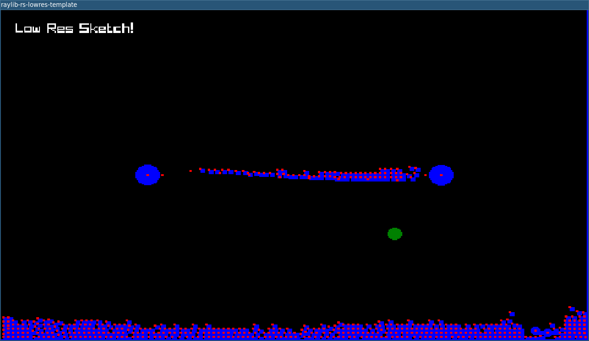

# trying-rapier

Small physics toy project using `rapier2d` and `raylib`.

## Archive Note

This repo was a short experiment from September 23, 2023. The focus was basic
play with Rapier 2D physics, including piles of rigid bodies, a hanging bridge,
and a simple car setup. It reads more like a quick sandbox for learning the
library than a game or engine.

An archival cleanup pass happened in March 2026. Dependency versions were
bumped forward, the project was brought back to a clean build, and the window
startup positioning was fixed so it centers correctly on the left-hand monitor
instead of spawning partly off-screen.

## Screenshot

## Run

Build:

`cargo build`

Run:

`cargo run`
